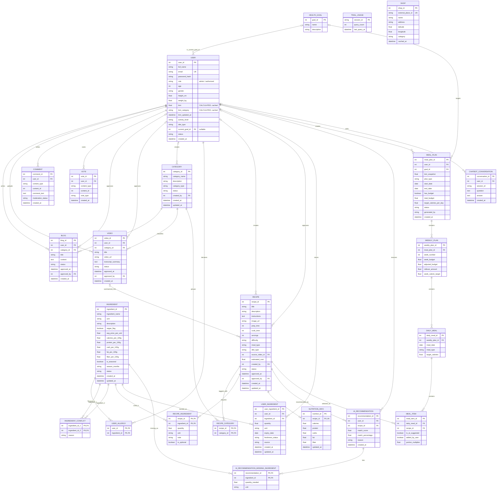

# ERD — VegetMealPlan

Bản Mermaid dùng để dựng entity/migration trong `backend/src/modules/**/entities`.
Paste vào [mermaid.live](https://mermaid.live) để xem hình.

```mermaid
erDiagram

    USER {
        int user_id PK
        string full_name
        string email UK
        string password_hash
        string role "admin / authorized"
        int age
        string gender
        float height_cm
        float weight_kg
        float bmi "CALCULATED, cached"
        string bmi_category "CALCULATED, cached"
        datetime bmi_updated_at
        string activity_level
        string diet_type
        int current_goal_id FK "nullable"
        string status
        datetime created_at
    }

    HEALTH_GOAL {
        int goal_id PK
        string name
        string description
    }

    BLOG {
        int blog_id PK
        int user_id FK
        int category_id FK
        string title
        text content
        string status
        datetime approved_at
        int approved_by FK
        datetime created_at
    }

    VIDEO {
        int video_id PK
        int user_id FK
        int category_id FK
        string title
        string video_url
        text transcript_summary
        string status
        datetime approved_at
        int approved_by FK
        datetime created_at
    }

    COMMENT {
        int comment_id PK
        int user_id FK
        string content_type
        int content_id
        text comment_text
        string moderation_status
        datetime created_at
    }

    VOTE {
        int vote_id PK
        int user_id FK
        string content_type
        int content_id
        string vote_type
        datetime created_at
    }

    CATEGORY {
        int category_id PK
        string category_name
        string description
        string category_type
        string status
        int created_by FK
        datetime created_at
        datetime updated_at
    }

    RECIPE_CATEGORY {
        int recipe_id PK,FK
        int category_id PK,FK
    }

    INGREDIENT {
        int ingredient_id PK
        string ingredient_name
        string unit
        string description
        boolean vegan_flag
        float avg_price_per_unit
        float calories_per_100g
        float protein_per_100g
        float carb_per_100g
        float fat_per_100g
        float fiber_per_100g
        boolean is_seasonal
        string season_months
        string status
        datetime created_at
        datetime updated_at
    }

    INGREDIENT_CONFLICT {
        int ingredient_id_1 PK,FK
        int ingredient_id_2 PK,FK
        string reason
    }

    RECIPE {
        int recipe_id PK
        string title
        string description
        text instructions
        string image_url
        int prep_time
        int cook_time
        int servings
        string difficulty
        string meal_type
        string diet_type
        int source_video_id FK
        float estimated_cost
        int created_by FK
        string status
        datetime approved_at
        int approved_by FK
        datetime created_at
        datetime updated_at
    }

    RECIPE_INGREDIENT {
        int recipe_id PK,FK
        int ingredient_id PK,FK
        float quantity
        string unit
        string note
        boolean is_optional
    }

    NUTRITION_INFO {
        int nutrition_id PK
        int recipe_id FK,UK
        float calories
        float protein
        float carbs
        float fat
        float fiber
        datetime updated_at
    }

    USER_INGREDIENT {
        int user_ingredient_id PK
        int user_id FK
        int ingredient_id FK
        float quantity
        string unit
        date expiry_date
        string freshness_status
        string source
        datetime created_at
        datetime updated_at
    }

    AI_RECOMMENDATION {
        int recommendation_id PK
        int user_id FK
        int recipe_id FK
        float match_score
        float match_percentage
        string reason
        datetime created_at
    }

    AI_RECOMMENDATION_MISSING_INGREDIENT {
        int recommendation_id PK,FK
        int ingredient_id PK,FK
        float quantity_needed
        string unit
    }

    USER_ALLERGY {
        int user_id PK,FK
        int ingredient_id PK,FK
    }

    MEAL_PLAN {
        int meal_plan_id PK
        int user_id FK
        int goal_id FK
        float bmi_snapshot
        string plan_type
        date start_date
        date end_date
        boolean has_budget
        float total_budget
        float target_calories_per_day
        string status
        string generated_by
        datetime created_at
    }

    WEEKLY_PLAN {
        int weekly_plan_id PK
        int meal_plan_id FK
        int week_number
        float week_budget
        float adjusted_budget
        float rollover_amount
        float week_calorie_target
    }

    DAILY_MEAL {
        int daily_meal_id PK
        int weekly_plan_id FK
        date meal_date
        string meal_type
        float target_calories
    }

    MEAL_ITEM {
        int meal_item_id PK
        int daily_meal_id FK
        int recipe_id FK
        boolean is_ai_suggested
        boolean added_by_user
        float portion_multiplier
    }

    CHATBOT_CONVERSATION {
        int conversation_id PK
        int user_id FK
        string session_id
        text question
        text answer
        datetime created_at
    }

    TRIAL_USAGE {
        string session_id PK
        int query_count
        datetime last_query_at
    }

    SHOP {
        int shop_id PK
        string external_place_id UK
        string name
        string address
        float latitude
        float longitude
        string category
        datetime cached_at
    }

    USER ||--o{ BLOG : writes
    USER ||--o{ VIDEO : uploads
    USER ||--o{ COMMENT : writes
    USER ||--o{ VOTE : casts
    USER |o--o{ BLOG : approves
    USER |o--o{ VIDEO : approves
    HEALTH_GOAL |o--o{ USER : is_current_goal_of

    CATEGORY ||--o{ BLOG : classifies
    CATEGORY ||--o{ VIDEO : classifies
    USER |o--o{ CATEGORY : creates
    CATEGORY ||--o{ RECIPE_CATEGORY : groups
    RECIPE ||--o{ RECIPE_CATEGORY : tagged_with

    USER ||--o{ USER_ALLERGY : declares
    INGREDIENT ||--o{ USER_ALLERGY : flagged_in
    INGREDIENT ||--o{ INGREDIENT_CONFLICT : ingredient_1
    INGREDIENT ||--o{ INGREDIENT_CONFLICT : ingredient_2
    INGREDIENT ||--o{ RECIPE_INGREDIENT : used_in
    RECIPE ||--o{ RECIPE_INGREDIENT : requires
    RECIPE ||--o| NUTRITION_INFO : has
    USER |o--o{ RECIPE : creates
    USER |o--o{ RECIPE : approves
    VIDEO |o--o{ RECIPE : summarized_into

    USER ||--o{ USER_INGREDIENT : stores
    INGREDIENT ||--o{ USER_INGREDIENT : tracked_as
    USER ||--o{ AI_RECOMMENDATION : receives
    RECIPE ||--o{ AI_RECOMMENDATION : recommended_as
    AI_RECOMMENDATION ||--o{ AI_RECOMMENDATION_MISSING_INGREDIENT : lists
    INGREDIENT ||--o{ AI_RECOMMENDATION_MISSING_INGREDIENT : missing_as

    USER ||--o{ MEAL_PLAN : creates
    HEALTH_GOAL |o--o{ MEAL_PLAN : targets
    MEAL_PLAN ||--o{ WEEKLY_PLAN : contains
    WEEKLY_PLAN ||--o{ DAILY_MEAL : contains
    DAILY_MEAL ||--o{ MEAL_ITEM : contains
    RECIPE ||--o{ MEAL_ITEM : selected_as

    USER |o--o{ CHATBOT_CONVERSATION : asks
```
