# ERD - VegetMealPlan

Cap nhat lan cuoi: sau vong gop y cua co (thang, price override, import, ho so BMI ho khac).

```mermaid
erDiagram

    USER {
        int user_id PK
        string full_name
        string email UK
        string password_hash
        string role "admin / authorized"
        int age
        string gender
        float height_cm
        float weight_kg
        float bmi "CALCULATED = weight_kg / (height_m)^2, cached"
        string bmi_category "CALCULATED: underweight/normal/overweight/obese, cached"
        datetime bmi_updated_at
        string activity_level "sedentary / light / moderate / active"
        string diet_type "vegan / lacto / ovo / ovo_lacto"
        int current_goal_id FK "nullable, -> HEALTH_GOAL"
        datetime premium_until "nullable; CACHED — null hoặc đã qua = free tier"
        string status "active / locked"
        datetime created_at
    }

    HEALTH_GOAL {
        int goal_id PK
        string name "lose_weight / gain_muscle / maintain"
        string description
    }

    BLOG {
        int blog_id PK
        int user_id FK
        int category_id FK
        string title
        text content
        string status "draft/pending_review/approved/rejected/removed"
        datetime approved_at "nullable"
        int approved_by FK "nullable, -> USER (admin)"
        datetime created_at
    }

    VIDEO {
        int video_id PK
        int user_id FK
        int category_id FK
        string title
        string video_url
        text transcript_summary
        string status "draft/pending_review/approved/rejected/removed"
        datetime approved_at "nullable"
        int approved_by FK "nullable, -> USER (admin)"
        datetime created_at
    }

    COMMENT {
        int comment_id PK
        int user_id FK
        string content_type "blog/video"
        int content_id
        text comment_text
        string moderation_status
        datetime created_at
    }

    VOTE {
        int vote_id PK
        int user_id FK
        string content_type "blog/video"
        int content_id
        string vote_type
        datetime created_at
    }

    CATEGORY {
        int category_id PK
        string category_name
        string description
        string category_type "food_type / recipe_type"
        string status "active / inactive"
        int created_by FK "nullable, -> USER (admin)"
        datetime created_at
        datetime updated_at
    }

    RECIPE_CATEGORY {
        int recipe_id PK,FK
        int category_id PK,FK
    }

    INGREDIENT {
        int ingredient_id PK
        string ingredient_name
        string unit
        string description
        boolean vegan_flag
        float avg_price_per_unit
        float calories_per_100g
        float protein_per_100g
        float carb_per_100g
        float fat_per_100g
        float fiber_per_100g
        boolean is_seasonal
        string season_months
        string status "active / inactive"
        datetime created_at
        datetime updated_at
    }

    INGREDIENT_CONFLICT {
        int ingredient_id_1 PK,FK "must be less than ingredient_id_2"
        int ingredient_id_2 PK,FK
        string reason
    }

    RECIPE {
        int recipe_id PK
        string title
        string description
        text instructions
        string image_url
        int prep_time "minutes"
        int cook_time "minutes"
        int servings
        string difficulty "easy/medium/hard"
        string meal_type
        string diet_type
        int source_video_id FK "nullable"
        float estimated_cost "cached, derived từ RECIPE_INGREDIENT; ƯỚC TÍNH, có thể lệch thực tế theo khu vực/thời điểm"
        int created_by FK "nullable, null = system-seeded"
        string status "draft/pending_review/approved/rejected/removed"
        datetime approved_at "nullable"
        int approved_by FK "nullable, -> USER (admin)"
        datetime created_at
        datetime updated_at
    }

    RECIPE_INGREDIENT {
        int recipe_id PK,FK
        int ingredient_id PK,FK
        float quantity
        string unit
        string note
        boolean is_optional
    }

    NUTRITION_INFO {
        int nutrition_id PK
        int recipe_id FK,UK "1:1 với RECIPE"
        float calories
        float protein
        float carbs
        float fat
        float fiber
        datetime updated_at
    }

    USER_INGREDIENT {
        int user_ingredient_id PK
        int user_id FK
        int ingredient_id FK
        float quantity
        string unit
        date expiry_date
        string freshness_status
        string source "MANUAL / PHOTO_SCAN"
        datetime created_at
        datetime updated_at
    }

    USER_INGREDIENT_PRICE {
        int user_id PK,FK
        int ingredient_id PK,FK
        float price_per_unit "giá user tự cập nhật, override avg_price_per_unit cho riêng user này"
        datetime updated_at
    }

    AI_RECOMMENDATION {
        int recommendation_id PK
        int user_id FK
        int recipe_id FK
        float match_score
        float match_percentage
        string reason
        datetime created_at
    }

    AI_RECOMMENDATION_MISSING_INGREDIENT {
        int recommendation_id PK,FK
        int ingredient_id PK,FK
        float quantity_needed
        string unit
    }

    USER_ALLERGY {
        int user_id PK,FK
        int ingredient_id PK,FK
    }

    FAVORITE_RECIPE {
        int user_id PK,FK
        int recipe_id PK,FK
        datetime created_at
    }

    MEAL_PLAN_PROFILE {
        int profile_id PK
        int user_id FK "chủ tài khoản quản lý hồ sơ này"
        string full_name
        int age
        string gender
        float height_cm
        float weight_kg
        float bmi "CALCULATED, cached"
        string bmi_category "CALCULATED, cached"
        string activity_level
        string diet_type
        datetime created_at
        datetime updated_at
    }

    MEAL_PLAN {
        int meal_plan_id PK
        int user_id FK
        int goal_id FK "nullable, snapshot of goal chosen for THIS plan"
        int target_profile_id FK "nullable, -> MEAL_PLAN_PROFILE; null = lập cho chính user"
        float bmi_snapshot "BMI của đối tượng được lập kế hoạch tại thời điểm tạo, immutable"
        string plan_type "weekly / monthly"
        date start_date
        date end_date
        boolean has_budget
        float total_budget "nullable"
        float target_calories_per_day
        string status "draft/active/completed"
        string generated_by "AI / manual"
        datetime created_at
    }

    WEEKLY_PLAN {
        int weekly_plan_id PK
        int meal_plan_id FK
        int week_number
        date start_date "ngày thật bắt đầu tuần này (tuần đầu có thể <7 ngày nếu tạo giữa tuần)"
        date end_date "ngày thật kết thúc tuần này (thường là Chủ Nhật)"
        float week_budget
        float adjusted_budget
        float rollover_amount
        float week_calorie_target
    }

    DAILY_MEAL {
        int daily_meal_id PK
        int weekly_plan_id FK
        date meal_date
        string meal_type
        float target_calories
    }

    MEAL_ITEM {
        int meal_item_id PK
        int daily_meal_id FK
        int recipe_id FK
        boolean is_ai_suggested
        boolean added_by_user
        float portion_multiplier
    }

    CHATBOT_CONVERSATION {
        int conversation_id PK
        int user_id FK "nullable"
        string session_id
        text question
        text answer
        datetime created_at
    }

    USAGE_QUOTA {
        int usage_id PK
        int user_id FK "nullable — null nếu actor là guest"
        string session_id "nullable — null nếu actor là user đã đăng nhập"
        string action_type "CHATBOT_QUERY / MEAL_PLAN_CREATE"
        int usage_count
        datetime period_start "đầu kỳ tính quota (đầu tháng dương lịch)"
        datetime updated_at
    }

    SHOP {
        int shop_id PK
        string external_place_id UK
        string name
        string address
        float latitude
        float longitude
        string category
        datetime cached_at
    }

    SUBSCRIPTION {
        int subscription_id PK
        int user_id FK
        int transaction_id FK,UK "1:1 với PAYMENT_TRANSACTION đã completed"
        string plan_type "monthly (hiện chỉ có 1 loại)"
        float amount
        date start_date
        date end_date
        string status "active / expired / cancelled"
        datetime cancelled_at "nullable"
        datetime created_at
    }

    PAYMENT_TRANSACTION {
        int transaction_id PK
        int user_id FK
        float amount
        string gateway "VNPAY"
        string gateway_txn_ref
        string gateway_transaction_no "nullable"
        string status "pending / success / failed"
        text raw_response "nullable"
        datetime paid_at "nullable"
        datetime created_at
    }

    NOTIFICATION {
        int notification_id PK
        int user_id FK
        string type "SUBSCRIPTION_SUCCESS / SUBSCRIPTION_EXPIRING / SUBSCRIPTION_EXPIRED / SUBSCRIPTION_CANCELLED / CONTENT_COMMENT / CONTENT_VOTE"
        string title
        string message
        string ref_type "nullable, cùng kiểu content_type ở COMMENT/VOTE"
        int ref_id "nullable"
        boolean is_read
        datetime created_at
    }

    RECIPE_IMPORT_BATCH {
        int batch_id PK
        int imported_by FK "-> USER (admin)"
        string file_name
        int total_rows
        int success_count
        int failed_count
        datetime created_at
    }

    RECIPE_IMPORT_ITEM {
        int import_item_id PK
        int batch_id FK
        int row_number
        string recipe_title
        string status "success / failed"
        string fail_reason "nullable: MISSING_REQUIRED_FIELD / UNKNOWN_INGREDIENT / INGREDIENT_CONFLICT"
        text fail_detail "nullable"
        int recipe_id FK "nullable, chỉ có khi import thành công"
    }

    USER ||--o{ BLOG : writes
    USER ||--o{ VIDEO : uploads
    USER ||--o{ COMMENT : writes
    USER ||--o{ VOTE : casts
    USER |o--o{ BLOG : approves
    USER |o--o{ VIDEO : approves
    HEALTH_GOAL |o--o{ USER : is_current_goal_of
    CATEGORY ||--o{ BLOG : classifies
    CATEGORY ||--o{ VIDEO : classifies
    USER |o--o{ CATEGORY : creates
    CATEGORY ||--o{ RECIPE_CATEGORY : groups
    RECIPE ||--o{ RECIPE_CATEGORY : tagged_with
    USER ||--o{ USER_ALLERGY : declares
    INGREDIENT ||--o{ USER_ALLERGY : flagged_in
    INGREDIENT ||--o{ INGREDIENT_CONFLICT : ingredient_1
    INGREDIENT ||--o{ INGREDIENT_CONFLICT : ingredient_2
    INGREDIENT ||--o{ RECIPE_INGREDIENT : used_in
    RECIPE ||--o{ RECIPE_INGREDIENT : requires
    RECIPE ||--o| NUTRITION_INFO : has
    USER |o--o{ RECIPE : creates
    USER |o--o{ RECIPE : approves
    VIDEO |o--o{ RECIPE : summarized_into
    USER ||--o{ USER_INGREDIENT : stores
    INGREDIENT ||--o{ USER_INGREDIENT : tracked_as
    USER ||--o{ USER_INGREDIENT_PRICE : overrides
    INGREDIENT ||--o{ USER_INGREDIENT_PRICE : priced_by
    USER ||--o{ FAVORITE_RECIPE : favorites
    RECIPE ||--o{ FAVORITE_RECIPE : favorited_by
    USER ||--o{ AI_RECOMMENDATION : receives
    RECIPE ||--o{ AI_RECOMMENDATION : recommended_as
    AI_RECOMMENDATION ||--o{ AI_RECOMMENDATION_MISSING_INGREDIENT : lists
    INGREDIENT ||--o{ AI_RECOMMENDATION_MISSING_INGREDIENT : missing_as
    USER ||--o{ MEAL_PLAN_PROFILE : manages
    MEAL_PLAN_PROFILE |o--o{ MEAL_PLAN : planned_for
    USER ||--o{ MEAL_PLAN : creates
    HEALTH_GOAL |o--o{ MEAL_PLAN : targets
    MEAL_PLAN ||--o{ WEEKLY_PLAN : contains
    WEEKLY_PLAN ||--o{ DAILY_MEAL : contains
    DAILY_MEAL ||--o{ MEAL_ITEM : contains
    RECIPE ||--o{ MEAL_ITEM : selected_as
    USER |o--o{ CHATBOT_CONVERSATION : asks
    USER |o--o{ USAGE_QUOTA : tracked_by
    USER ||--o{ SUBSCRIPTION : purchases
    USER ||--o{ PAYMENT_TRANSACTION : initiates
    PAYMENT_TRANSACTION |o--o| SUBSCRIPTION : funds
    USER ||--o{ NOTIFICATION : receives
    USER ||--o{ RECIPE_IMPORT_BATCH : imports
    RECIPE_IMPORT_BATCH ||--o{ RECIPE_IMPORT_ITEM : contains
    RECIPE |o--o| RECIPE_IMPORT_ITEM : created_from
```

## Ghi chu quyet dinh (judgment calls)

1. **Gia ca nhan hoa (USER_INGREDIENT_PRICE)**: moi user co the o khu vuc khac
   nhau nen gia thuc te khac nhau. Uu tien gia user tu cap nhat, khong co thi
   fallback ve `INGREDIENT.avg_price_per_unit`.
2. **MEAL_PLAN_PROFILE**: ho so nguoi khac (con/vo chong...) duoc luu lai nhu
   lich su, tai su dung duoc cho nhieu `MEAL_PLAN` sau nay - khong phai nhap
   lai tu dau moi lan.
3. **RECIPE_IMPORT_BATCH / RECIPE_IMPORT_ITEM**: import hang loat cho Admin.
   1 dong bi bo qua (khong tao Recipe) neu: thieu field bat buoc, HOAC nguyen
   lieu khong ton tai trong he thong, HOAC nguyen lieu xung khac voi nhau
   trong cung cong thuc (check tung CAP trong INGREDIENT_CONFLICT, khong chi
   1-1 voi nguyen lieu vua them). Khac voi luong tao thu cong (chi CANH BAO,
   khong chan) vi import khong co nguoi ngoi xem tung dong.
4. **FAVORITE_RECIPE**: chi ap dung cho RECIPE (khong ap dung BLOG/VIDEO).
5. **USAGE_QUOTA thay TRIAL_USAGE cu**: gop logic quota guest (theo session_id)
   / authorized-free (theo user_id, 5 lan/thang) / premium (khong gioi han)
   vao 1 bang, tranh 2 he thong dem quota song song de lech nhau. Reset theo
   thang duong lich (gia dinh - can xac nhan lai neu y that la gioi han
   tron doi).
6. **SUBSCRIPTION / PAYMENT_TRANSACTION tach rieng**: VNPay co the pending/fail
   nhieu lan truoc khi thanh cong; chi khi `status=success` moi sinh ra 1 dong
   SUBSCRIPTION. Khong auto-renew - het han thi bao (NOTIFICATION) chu khong
   tu tru tien lai.
7. **WEEKLY_PLAN.start_date/end_date**: tuan snap theo lich duong (T2-CN), tuan
   dau co the ngan hon 7 ngay neu meal_plan tao giua tuan - nen KHONG the suy
   ra tu 1 cong thuc offset co dinh, phai luu explicit.
